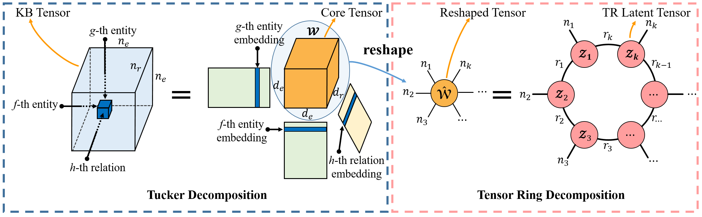

# Generalizing Tensor Decomposition for N-ary Relational Knowledge Bases

  


  ## Link Prediction Results on N-ary Relational KBs

| Dataset      |  MRR  | Hits@10 | Hits@3 | Hits@1 |
| :----------- | :---: | :-----: | :----: | :----: |
| WikiPeople-3 | 0.373 |  0.588  | 0.401  | 0.284  |
| WikiPeople-4 | 0.386 |  0.596  | 0.462  | 0.265  |
| JF17K-3      | 0.732 |  0.856  | 0.764  | 0.669  |
| JF17K-4      | 0.810 |  0.913  | 0.844  | 0.755  |

  ### Running a model

  To run the model, execute the following command:

	CUDA_VISIBLE_DEVICES=0 python main.py --dataset dataset --num_iterations 200 --batch_size batch_size 
  	--edim edim --rdim rdim --k k --n_i n_i --TR_ranks TR_ranks --dr dr --lr lr --input_dropout --input_d 
  	--hidden_dropout --hidden_d

  Available datasets are:
  	
	WikiPeople-3, WikiPeople-4, JF17K-3, JF17K-4

  To reproduce the results from the paper, use the following hyperparameters settings:

  ### Hyperparameters Settings 

| Dataset      | batch_size | edim | rdim | k    | n_i  | TR_ranks |  dr   |          lr           |       input_d        |      hidden_d       |
| :----------- | :--------: | :--: | :--: | ---- | ---- | :------: | :---: | :-------------------: | :------------------: | :-----------------: |
| WikiPeople-3 |    128     |  50  |  50  | 4    | 50   |    50    | 0.995 | 0.0009267003174594345 |  0.3740776415163665  | 0.45137914784181227 |
| WikiPeople-4 |    128     |  25  |  25  | 5    | 25   |    40    | 0.995 | 0.006701566797680926  | 0.46694419227220374  | 0.18148844341064124 |
| JF17K-3      |    128     |  50  |  50  | 4    | 50   |    50    | 0.99  | 0.0008658318809880197 | 0.12747824547053027  |  0.501929359180091  |
| JF17K-4      |    128     |  25  |  25  | 5    | 25   |    40    | 0.995 | 0.0006071265071591076 | 0.010309222253012645 | 0.43198147413900445 |


  ## Link Prediction Results on binary Relational KBs (KGs)

| Dataset |  MRR  | Hits@10 | Hits@3 | Hits@1 |
| :-----: | :---: | :-----: | :----: | :----: |
|  WN18   | 0.948 |  0.954  | 0.950  | 0.945  |
|  FB15k  | 0.824 |  0.888  | 0.847  | 0.787  |


  ### Running a model

  	CUDA_VISIBLE_DEVICES=0 python main.py --dataset dataset --num_iterations 200 --batch_size batch_size 
  	--edim edim --rdim rdim --k k --n_i n_i --TR_ranks TR_ranks --dr dr --lr lr --input_dropout --input_d 
  	--hidden_dropout1 hidden_d1 --hidden_dropout2 hidden_d2 

  Available datasets are:
  	
	WN18, FB15K

  ### Hyperparameters Settings 
| Dataset | batch_size | edim | rdim |  k   | n_i  | TR_ranks |  dr   |   lr   | input_d | hidden_d1 | hidden_d2 |
| :------ | :--------: | :--: | :--: | :--: | :--: | :------: | :---: | :----: | :-----: | :-------: | :-------: |
| WN18    |    128     | 200  | 200  |  3   | 200  |    50    | 0.995 | 0.0005 |   0.2   |    0.1    |    0.2    |
| FB15k   |    512     | 200  | 200  |  3   | 200  |    50    | 0.995 | 0.0005 |   0.3   |    0.5    |    0.0    |


  ### Requirements
  	python     3.6.8
	numpy     1.16.3.1
	pytorch    1.0.1

  ## Reference

  ```latex
  @inproceddings{liu2020getd,
  	title 	  = {Generalizing Tensor Decomposition for N-ary Relational Knowledge Base},
  	author	  = {Liu, Yu and Yao, Quanming and Li, Yong},
  	booktitle = {The World Wide Web Conference},
  	year      = {2020},
  }
  ```

  ## Acknowledgement
  The codes of this paper are based on the codes of TuckER (https://github.com/ibalazevic/TuckER) . We appreciate TuckER's codes and thank the authors of TuckER.

  